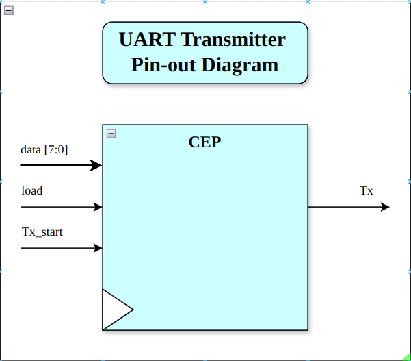

# UART Transmitter

## Overview 

This repository contains the implementation of Universal Asynchronous reciever-transmitter. Our implementaion supports transmitter part only.
	
## Description

A UART is usually an individual (or part of an) intergrated circuit (IC) used for serial communications over a computer or peripheral device serial port. One or more UART peripherals are commonly integrated in microcontroller chips.
	
## Languages Used

  * System Verilog
	
# System Design Overview

Representation of architecture through clear block diagrams is shown below.
	
## Pinout Diagram

The pinout diagram of the UART transmitter is given below.

